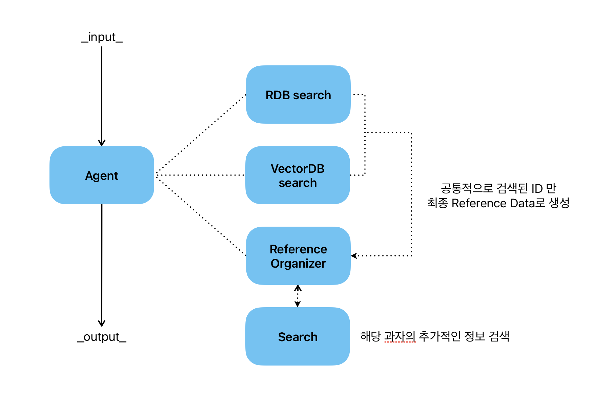
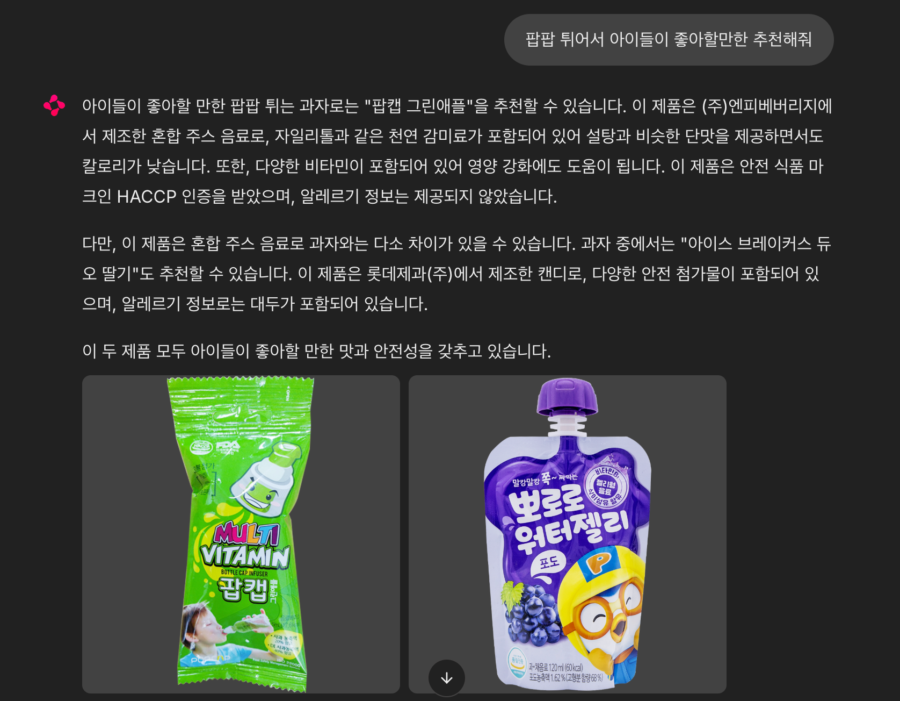
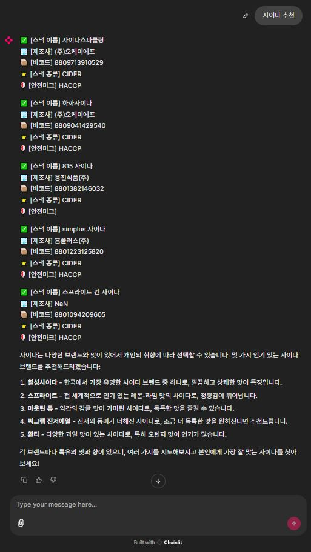

# 🍘 SnackRAG: 과자/첨가물 GPT 기반 검색 시스템

SnackRAG는 식품 및 첨가물 정보를 OpenAI GPT-4o를 이용해 자연어로 질문하고,
LangChain 기반 RAG(Retrieval-Augmented Generation) 구조를 통해 실시간으로 답변하는 FastAPI + Chainlit 프로젝트입니다.

---

## 🧠 기술 스택

- **LLM**: OpenAI GPT-4o via LangChain
- **Vector DB**: PostgreSQL + PGVector
- **Embedding**: `text-embedding-3-small`
- **Backend**: FastAPI + SQLModel
- **Frontend**: Chainlit (React 기반 LLM 채팅 UI)
- **Streaming**: SSE (Server-Sent Events)

---

## 🚀 실행 방법

```bash
# Docker 실행
docker-compose up --build

# Chainlit 실행 (포트 8502)
chainlit run chainlit/main.py --port 8502
```

---

## 🔍 주요 API

| Endpoint | 설명 |
|----------|------|
| `/api/v1/snacks/test/rag` | 쿼리 기반 GPT-4 응답 생성 |
| `/api/v1/snacks/sse` | SSE 기반 스트리밍 응답 |
| `/api/v1/snacks/test/rag/context-only` | GPT 호출 없이 유사 문서만 검색 |

---

## 🧪 예시 질문

- "MSG가 들어간 과자를 알려줘"
- "아이들에게 안전한 과자를 추천해줘"
- "이 첨가물은 어떤 용도인가요?"

---

## 🗂️ 폴더 구조

- `app/` - 백엔드 전체 구성
- `app/repository/` - PGVector 및 DB 액세스
- `app/services/` - RAG 로직, GPT 호출
- `chainlit/` - 프론트엔드 UI
- `sql/` - 데이터 초기화 및 임베딩 대상
---

## 🧠 RAG 시스템 구성

SnackRAG는 Retrieval-Augmented Generation 구조를 다음과 같이 구현합니다:

```text
[User Query]
    ↓
[Retriever] PGVector로 유사 문서 검색
    ↓
[Context Builder] 관련 정보 문자열 구성
    ↓
[Generator] LangChain 기반 GPT-4o 호출
    ↓
[Streaming Response] Chainlit 또는 FastAPI를 통해 SSE 전송
```

- 문서 임베딩: `OpenAIEmbeddings(text-embedding-3-small)`
- LLM 응답: `ChatOpenAI(model="gpt-4o")`
- 벡터 검색: cosine 유사도 기반
- 문맥 주입: 프롬프트 템플릿 내 `{context}` 활용

---

## 🔎 데이터베이스 모델 개요

| 테이블 | 설명 |
|--------|------|
| `snack` | 과자 기본 정보 |
| `snack_additive` | 첨가물 정보 및 등급 |
| `snack_item` | 과자별 영양 성분 |
| `map_snack_item_additive` | 과자-첨가물 관계 N:M 매핑 |
| `pg_embedding` | 벡터화된 문서와 메타데이터 저장소 |

---

## 🧪 테스트

```bash
pytest tests/
```

단위 테스트 예시:
- RAG 응답이 정상적으로 생성되는지 확인
- 응답이 문자열이고, 필수 키워드를 포함하는지 검증

---

## 📦 향후 개선 방향

- ✅ LangSmith 추적 활성화
- ✅ 문서 relevance 평가 모델 고도화 (re-ranking)
- ✅ 사용자 프로파일 기반 추천 시스템 접목
- ✅ 프롬프트 다양화 및 안전성 체크 모델 추가

---

## 🧠 RAG 시스템 상세 설명

이 프로젝트는 Retrieval-Augmented Generation(RAG) 구조를 기반으로 다음 단계를 따릅니다:

### 1. 사용자 질문 입력
Chainlit 또는 FastAPI API를 통해 사용자 자연어 질문(query)을 입력받습니다.

### 2. 문서 검색 (Retriever)
`app/repository/pgvector_repository.py`에서 PGVector를 이용해 사용자 질문을 임베딩하고,
cosine similarity 기반으로 관련 문서를 검색합니다.

- 사용 임베딩 모델: `text-embedding-3-small`
- 벡터 저장소: PostgreSQL + PGVector

### 3. 문맥 구성 (Context Builder)
검색된 문서 리스트는 `app/services/rag_service_test.py`에서 LangChain의 `Document` 형식으로 처리되고,
프롬프트 내 `{context}` 자리에 삽입됩니다.

```python
context = "\n\n".join([
  f"문서 {i + 1}:\n{doc.page_content}\n메타데이터: {doc.metadata}"
])
```

### 4. GPT 응답 생성 (Generator)
LangChain의 `ChatOpenAI(model="gpt-4o")`를 사용해 완성된 프롬프트를 GPT에게 전달합니다.
응답은 실시간으로 토큰 단위로 스트리밍됩니다 (`StreamingResponse`).

### 5. 실시간 응답 전송
`/snacks/sse` 또는 `/snacks/test/rag/context` 엔드포인트를 통해 사용자에게 실시간 전송됩니다.
Chainlit에서는 `httpx.AsyncClient`를 통해 SSE를 수신하고 출력합니다.

---

## 📁 폴더별 RAG 관련 설명

### 📂 `app/services`

- **`rag_service_test.py`**: RAG의 핵심 구현 위치. 문서 검색 → 문맥 구성 → GPT 응답 생성.
- **`pgvector_service.py`**: LLM 기반 문서 relevance 재선정 (LLM-based re-ranking).
- **`rag_service.py`**: 검색된 문서 + DB 상세정보를 함께 응답 (혼합형 응답용).
- **`generized_metadate_by_ID.py`**: LLM을 통해 벡터 문서의 메타데이터 생성 자동화.

### 📂 `app/api`

- **`routes/snacks.py`**: `/snacks/test/rag`, `/snacks/sse` 등 API 엔드포인트 정의.
- **`dto/models.py`**: RAG 응답 형식 정의 (`SnackContextPayload`, `SnackRagDocument` 등).
- **`deps.py`**: DB 세션 및 의존성 주입 정의.

### 📂 `app/core`

- **`agent_tools.py`**: GPT-4o 모델, OpenAI 임베딩 모델, PGVector 벡터스토어 정의.
- **`prompt.py`**: GPT 입력용 프롬프트 템플릿 정의 (`SEARCH_SELECT_INSTRUCTIONS`, `RAG_PROMPT`).
- **`db.py` / `config.py`**: DB 연결 설정 및 환경 변수 로딩 담당.

---

## 📌 요약

이 프로젝트는 단순 문서 기반 검색을 넘어서, 구조화된 과자/첨가물 데이터를 벡터화하여 저장하고,
LangChain + GPT-4o로 의미 있는 질의응답을 제공하는 **정형 + 생성형 통합형 RAG 시스템**입니다.

# 🏛 최종 아키텍쳐



## 🏆 해커톤 및 결과 이미지




